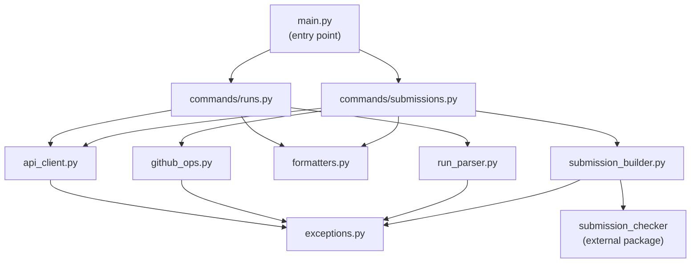
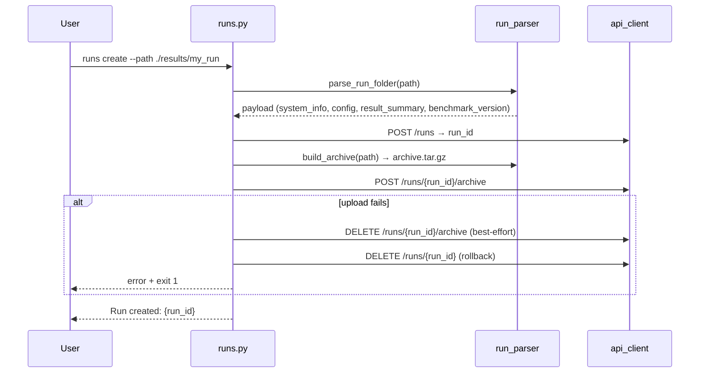
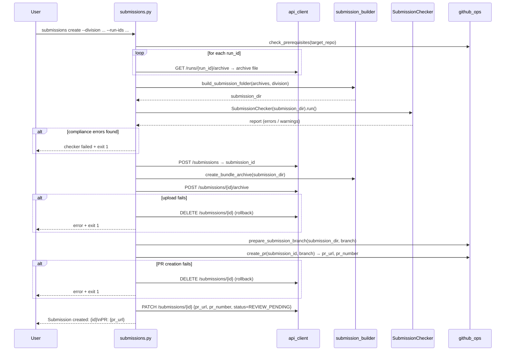
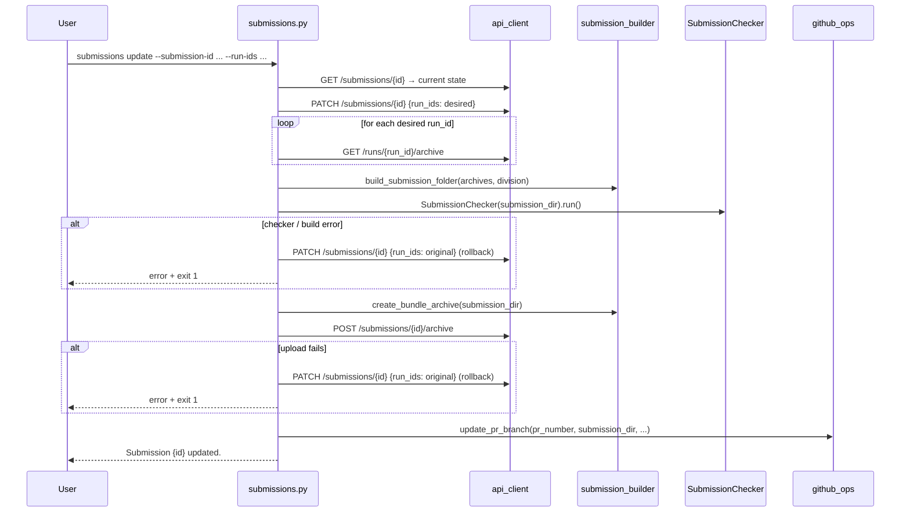

# Architecture

## Module map

```
src/endpoints_submission_cli/
├── main.py               Entry point — Click group, registers `runs` and `submissions`
├── api_client.py         HTTP client wrapping every PRISM API endpoint (httpx)
├── run_parser.py         Parses local run folder → API payload; builds .tar.gz archive
├── submission_builder.py Assembles submission folder from run archives; creates bundle
├── github_ops.py         Shells out to `gh` CLI for PR create/update/close
├── formatters.py         Rich table output and JSON mode for runs and submissions
├── exceptions.py         Custom exception hierarchy
└── commands/
    ├── runs.py           6 run commands (list, create, get, delete, pin, unpin)
    └── submissions.py    7 submission commands + 3 rollback helpers
```

### Module responsibilities

| Module | Responsibility |
|---|---|
| `main.py` | Registers command groups. Entry point for the `endpoints-submission-cli` script. |
| `api_client.py` | All HTTP calls to the PRISM API. Three timeout profiles. Token resolution. Error translation to `APIError`/`AuthError`. |
| `run_parser.py` | Reads `system_info.json`, `config.yaml`, `result_summary.json` from a local folder. Derives `benchmark_version` from `git_sha` or `"unknown"`. Builds `.tar.gz` archive. |
| `submission_builder.py` | Extracts run archives, groups by `(system_id, model)`, writes the submission folder tree (`systems/`, `pareto/`). Calls `submission_checker.models` for `compute_regions`. |
| `github_ops.py` | Clones the submission repo, creates/updates branches, commits, pushes, creates/closes PRs. All via `gh` CLI subprocess calls. |
| `formatters.py` | Rich table renderers for run and submission lists/details. JSON output with syntax highlighting. |
| `exceptions.py` | `APIError`, `AuthError`, `ArchiveError`, `GitHubError`, `RunFolderError`, `SubmissionBuildError`, `SubmissionCheckError`. |
| `commands/runs.py` | Click command implementations for all run operations. Delegates to `api_client` and `run_parser`. |
| `commands/submissions.py` | Click command implementations for all submission operations. Orchestrates the full pipeline and rollback helpers. |

---

## Module dependency diagram



---

## Command flow diagrams

### `runs create`



---

### `submissions create`



---

### `submissions update` (with `--run-ids`)



---

### PR branch update strategy (`update_pr_branch`)

Used by `submissions update`, `submissions add-run`, and `submissions remove-run`:

```
For each <system_id>/<model> in the fresh build:
│
├── points/      → replace entirely from fresh build
├── accuracy/    → replace entirely from fresh build
└── results/
    ├── Remove point dirs no longer in fresh build
    └── For each point dir in fresh build:
        ├── Copy log files (mlperf_endpoints_log_*.json)
        └── system_desc.json:
            ├── Preserve from PR branch (manual edits survive)
            └── Seed from fresh build only for new points

systems/   → preserve from PR branch (seed if absent)
src/       → preserve from PR branch
```

---

## Exception hierarchy

```
Exception
├── APIError          — any PRISM API call failure (4xx/5xx or network)
│   └── AuthError     — 401/403 or missing token
├── ArchiveError      — archive file open/upload/download/extract failure
├── GitHubError       — gh CLI subprocess failure
├── RunFolderError    — missing or malformed files in run folder
├── SubmissionBuildError — failure assembling submission folder tree
└── SubmissionCheckError — Submission Checker found compliance errors
```

`AuthError` extends `APIError` so callers that only catch `APIError` also handle auth failures.

---

## Deviations from the OpenAPI spec

| Area | Implementation | Spec |
|---|---|---|
| `benchmark_version` | Derived from `result_summary.git_sha`; falls back to `"unknown"`. Never reads the CLI package's own git hash. | Field in `RunCreate`. |
| `download_submission_archive` | Function exists in `api_client.py` but is not exported in `__all__` and not called by any command. | `GET /submissions/{id}/archive` defined in spec. |
| Submission status on create | Set to `REVIEW_PENDING` after PR creation (step 9 of `submissions create`), not at registration time. | `status` is a field on `SubmissionCreate`. |
| Rollback on PR failure | Uses `DELETE /submissions/{id}` (withdraw) as the rollback for a failed PR creation. This sets status to `WITHDRAWN`. | Spec defines `DELETE /submissions/{id}` as the withdraw endpoint. |
